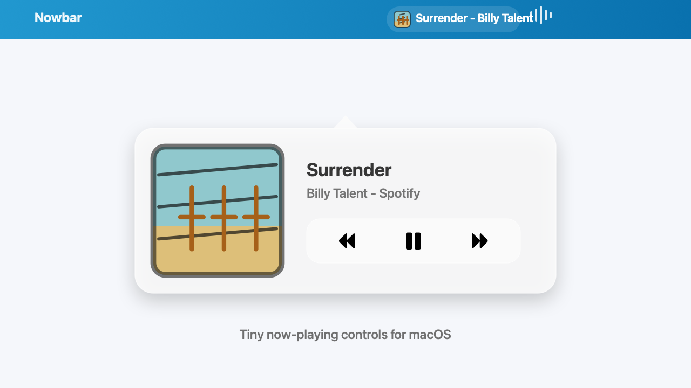

# Nowbar

Pure Swift macOS menu bar app that shows and controls current media from the status bar.

Copyright (C) 2026 Burak Karahan.



Supported local readers:

- Spotify, when Spotify is playing or paused.
- Music, when Apple Music is playing or paused.
- YouTube or YouTube Music tabs in Safari, Chrome, Brave, or Edge.

macOS does not expose a public global now-playing API for every app. This app uses Apple platform APIs only: AppKit for the menu bar item, `NSRunningApplication` for app detection, and Apple Events via `NSAppleScript` for apps and browsers that expose scriptable metadata.

Click the status bar item to open the compact player. Right-click it to quit. Long titles are truncated.

## Run

```bash
./script/build_and_run.sh
```

The first run may trigger macOS Automation permission prompts for Spotify, Music, or supported browsers.

## Package

Create a local package:

```bash
./script/package_release.sh
```

Create signed release artifacts for notarization:

```bash
CODE_SIGN_IDENTITY="Developer ID Application: Your Name (TEAMID)" \
INSTALLER_SIGN_IDENTITY="Developer ID Installer: Your Name (TEAMID)" \
./script/package_release.sh
```

Notarize and staple the app ZIP:

```bash
KEYCHAIN_PROFILE=nowbar-notary ./script/notarize_release.sh release/Nowbar-1.0.0.zip
```

The app registers itself as a macOS login item on first launch. The optional installer package places `Nowbar.app` in `/Applications`, registers a per-user LaunchAgent, launches Nowbar after install, and starts it at login. Public notarized installer packages require a `Developer ID Installer` certificate in addition to the `Developer ID Application` certificate used for the app.

## License

Nowbar is licensed under the GNU General Public License v3.0 or later. See [LICENSE](LICENSE).
